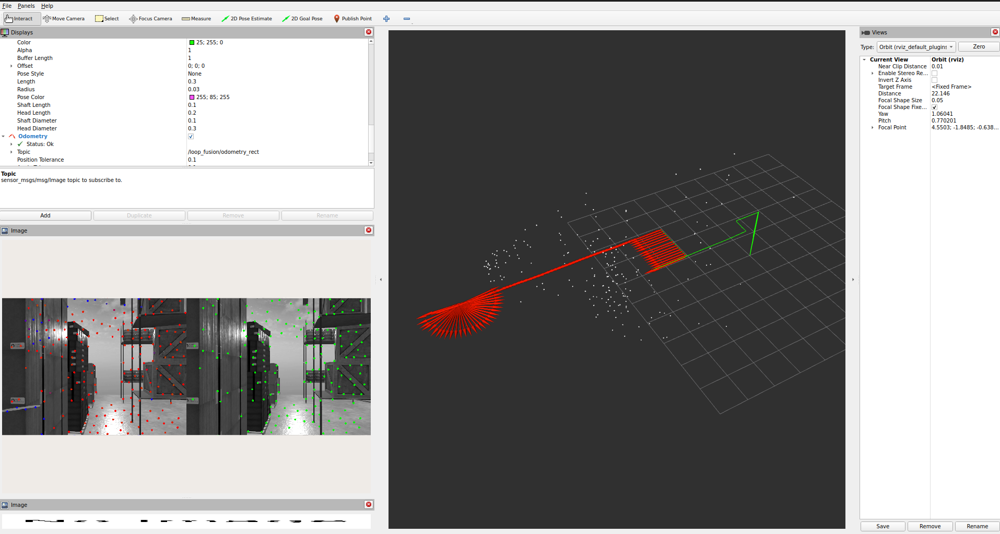
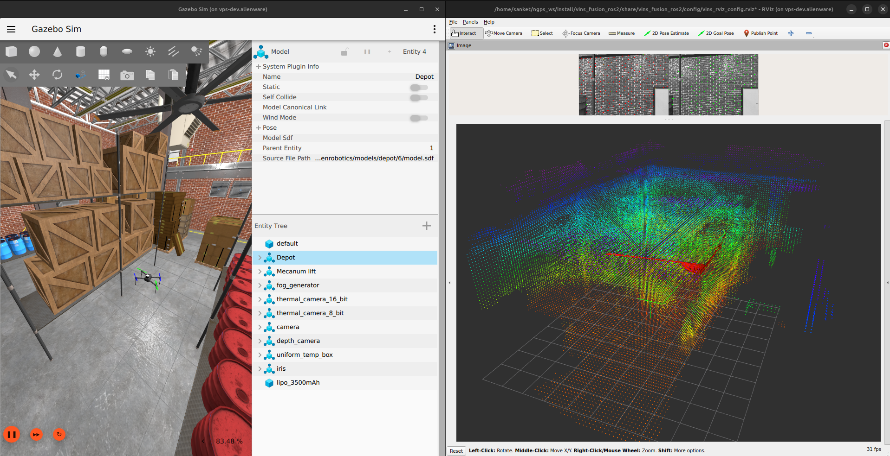

# vins_fusion_ros2

This repository is a ROS 2 adaptation of the original [VINS-Fusion](https://github.com/HKUST-Aerial-Robotics/VINS-Fusion) project. It supports visual-inertial odometry for both monocular and stereo camera setups, with optional GNSS/IMU fusion for global localization.

## Features

- Ported to ROS 2 (Humble and later)
- Compatible with stereo or monocular cameras
- Integration with IMU
- Supports tightly coupled sensor fusion
- Output of odometry and pose
- Loop fusion(pose graph / DBoW) and Global Fusion ported for ROS 2

## Prerequisites
- **System**
  - Ubuntu 22.04
  - ROS2 humble
- **Libraries**
  - OpenCV (with CUDA enabled option)
  - [Ceres Solver-2.1.0](http://ceres-solver.org/installation.html) (you can refer [here](https://github.com/zinuok/VINS-Fusion#-ceres-solver-1); just edit 1.14.0 to 2.1.0 for install.)
  - [Eigen-3.3.9](https://github.com/zinuok/VINS-Fusion#-eigen-1)
  - glog

### Install Dependencies
```bash
sudo apt-get install libgoogle-glog-dev libeigen3-dev libceres-dev libopencv-dev 
```
## Build Instructions

```bash
cd $(PATH_TO_YOUR_ROS2_WS)/src
git clone git@github.com:snktshrma/vins_fusion_ros2.git
cd ..
colcon build --symlink-install && source ./install/setup.bash && source ./install/local_setup.bash
```

**CMake / ROS 2 build guide:** see [docs/CMAKE_ROS2_GUIDE.md](docs/CMAKE_ROS2_GUIDE.md) for a full walkthrough of `CMakeLists.txt`, ament, targets, and debugging.

## Run with Ardupilot ROS2-Gazebo

Local VIO/VO only:

```bash
ros2 launch vins_fusion_ros2 vins_fusion_ros2.launch.py use_sim_time:=true
```

VIO + loop closure:

```bash
ros2 launch vins_fusion_ros2 vins_fusion_full.launch.py use_sim_time:=true # publishes /loop_fusion/odometry_rect
```



Rolling voxel map:
(Base for geometric understanding, memory and trajectory planning, will add modern representations as requirement pops up)

```bash
ros2 launch vins_fusion_ros2 voxel_map.launch.py use_sim_time:=true
```

Uses `/loop_fusion/odometry_rect` pose + `/camera/depth/points`. Publishes `/voxel_map/occupancy`. (Currently using hardcoded TFs in script)



## Gazebo (ArduPilot + ROS 2)

For the Gazebo + ArduPilot SITL workspace (`ardupilot_gz`, iris stereo cameras), follow the official setup guide:

**[ROS 2 with Gazebo (ArduPilot dev docs)](https://ardupilot.org/dev/docs/ros2-gazebo.html)**

> After setting up all packages, switch **ardupilot_gz** to `dev/vins` branch: [https://github.com/snktshrma/ardupilot_gz/tree/dev/vins](https://github.com/snktshrma/ardupilot_gz/tree/dev/vins)

Typical flow:

1. Build `ardupilot_gz_bringup` per that guide (`colcon build --packages-up-to ardupilot_gz_bringup`).
2. Start sim (warehouse uses stereo iris):
   ```bash
   ros2 launch ardupilot_gz_bringup iris_warehouse.launch.py # launcnes stereo cams and TFs
   ```
3. Run VINS with the Gazebo stereo config:
   ```bash
   ros2 launch vins_fusion_ros2 vins_fusion_ros2.launch.py use_sim_time:=true \
     config_file:=$(ros2 pkg prefix vins_fusion_ros2)/share/vins_fusion_ros2/config/gazebo/gazebo_stereo_config.yaml
   ```

**Topics:**

Topics published:

- `/camera/image`, `/camera1/image`: Left and right camera images
- `/vins_estimator/odometry`: VIO odometry (with launch namespace)
- `/ap/v1/imu/experimental/data`: ArduPilot IMU data over DDS ROS2

## Converting ROS 1 Bag Files to ROS 2 Format

### ROS 2 cannot play ROS 1 `.bag` files directly

Unfortunately, you **cannot directly play** a `.bag` file recorded in **ROS 1** using **ROS 2** tools like `ros2 bag play`.

This is because:

- ROS 1 `.bag` files are stored as a **single binary file**.
- ROS 2 `.bag` files use a **folder-based structure** containing:
  - a `.db3` SQLite3 database,
  - metadata YAML files.

---

### Convert ROS 1 `.bag` to ROS 2 `.db3`

You can convert ROS 1 `.bag` files to ROS 2 `.db3` format using [`rosbags`](https://pypi.org/project/rosbags/).

#### 1. Install `rosbags`

```bash
pip install rosbags
```

If you're using `~/.local/bin` (default for user-level installs), you may need to add it to your shell PATH:

```bash
export PATH=$PATH:~/.local/bin
```

You may also consider putting the above line in your `.bashrc` or `.zshrc`.

---

#### 2. Convert the `.bag` file

```bash
rosbags-convert --src foo.bag --dst /path/to/output_folder
```

- `foo.bag`: your original ROS 1 bag file
- `/path/to/output_folder`: target folder where converted ROS 2 `.db3` bag will be saved

---

#### 3. Play the converted bag file

Once conversion is complete, you can play it back using ROS 2 tools:

```bash
ros2 bag play /path/to/output_folder
```

---


## License
The source code is released under [GPLv3](http://www.gnu.org/licenses/) license.

We are still working on improving the code reliability. For any technical issues, please contact Tong Qin <qintonguavATgmail.com>.

For commercial inquiries, please contact Shaojie Shen <eeshaojieATust.hk>.